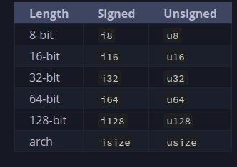

# Chapter 3 

### mutability 
- variables are immutable by default
  - can be changed by adding mut to the declaration of the variable. 

### Constants 
- not allowed to be mut 
- used by prefecing with `const` keyword. 
- can only be set to a constant expression, not the result of a value from run time. 
- Constants are valid for the entire time a program runs, within the scope in which they were declared.

### Shadowing 

- you can declare a new variable with the same name as a previous variable. Rustaceans say that the first variable is shadowed by the second, which means that the second variable is what the compiler will see when you use the name of the variable.

- Shadowing is different from marking a variable as `mut` because we’ll get a compile-time error if we accidentally try to reassign to this variable without using the `let` keyword. 

## Data Types
- Every value in Rust is of a certain data type, which tells Rust what kind of data is being specified so it knows how to work with that data.

### Scalar 
- A scalar type represents a single value. Rust has four primary scalar types: integers, floating-point numbers, Booleans, and characters. 

#### Integer Types
An integer is a number without a fractional component.

 
the `isize` and `usize` types depend on the architecture of the computer your program is running on, which is denoted in the table as “arch”: 64 bits if you’re on a 64-bit architecture and 32 bits if you’re on a 32-bit architecture.

#### Floating Point Types
Rust also has two primitive types for floating-point numbers, which are numbers with decimal points. Rust’s floating-point types are `f32` and `f64`, which are 32 bits and 64 bits in size, respectively.
  

### Compound
Compound types can group multiple values into one type. Rust has two primitive compound types: tuples and arrays.

#### Tuples
A tuple is a general way of grouping together a number of values with a variety of types into one compound type. Tuples have a fixed length: once declared, they cannot grow or shrink in size.

